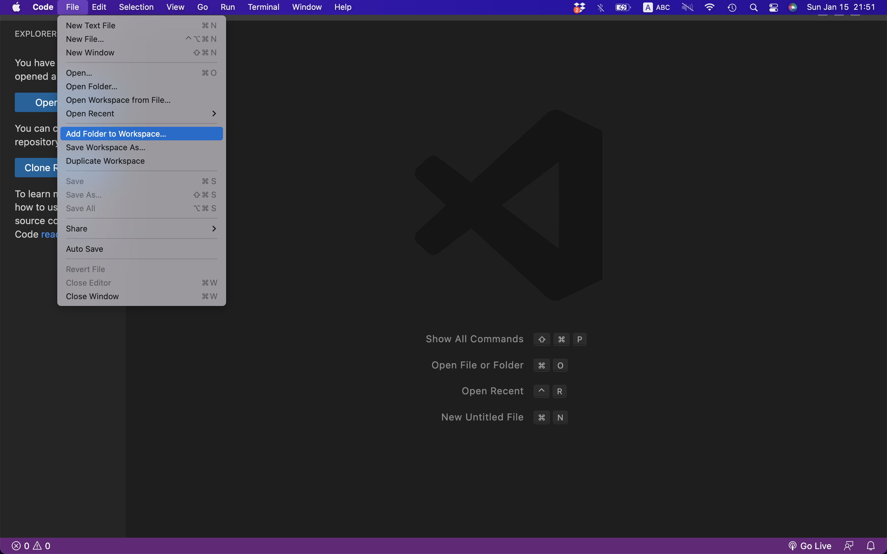
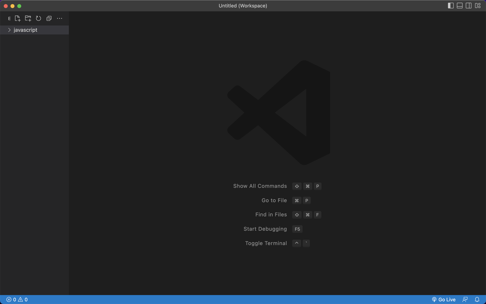
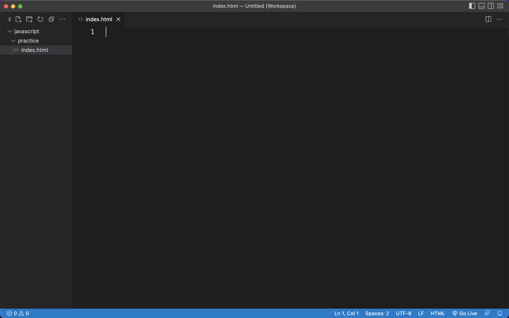

# 1.4 第一個 JavaScript

## 練習：第一個 JavaScript


### 第一步：建立資料夾及檔案

請先在自己的電腦桌面或其它您自己習慣的位置，建立一個 `javascript` 資料夾，然後使用編輯器開啟該資料夾，如下圖：

<figure><figcaption></figcaption></figure>

<figure><figcaption></figcaption></figure>


然後在 `javascript` 資料夾裡，建立一個 `practice` 資料夾。\
然後在 `practice` 資料夾裡，建立一個 `index.html` 檔案。如下圖：

<figure><figcaption></figcaption></figure>


### 第二步：index.html 內容

編輯 `index.html`，原始碼如下，可直接複製貼上，原始碼需整齊：

```markup
<!DOCTYPE html>
<html lang="zh-Hant">
  <head>
    <meta charset="utf-8">
    <title></title>
  </head>
  <body>
  
    <div class="block">
      這是 div 區塊
      <p class="para">這是段落</p>
    </div>

    <br>

    <button type="button" id="btn1">取得內容</button>
    <button type="button" id="btn2">更新內容</button>
    <button type="button" id="btn3">刪除元素節點</button>
    <button type="button" id="btn4">建立元素節點</button>
    
    <script></script>
  </body>
</html>
```


### 第三步：撰寫 CSS

以下原始碼放到 `</head>` 結束標籤之前：

```markup
<style>
  div.block{
    border: 1px solid black;
    color: red;
  }
  p.para{
    border: 1px solid blue;
    color: blue;
  }
</style>
```


### 第四步：撰寫 JS - 取得內容

在 script 標籤中，放入以下原始碼：

```javascript
// 取得內容
var btn1 = document.getElementById("btn1");
btn1.addEventListener("click", function(){ // click 事件綁定
  let block = document.getElementsByClassName("block")[0];
  console.log(block.innerHTML);
});
```

執行看看。


### 第五步：撰寫 JS - 更新內容

在 script 標籤中，再放入以下原始碼：

```javascript
// 更新內容
var btn2 = document.getElementById("btn2");
btn2.addEventListener("click", function(){
  let block = document.getElementsByClassName("block")[0];
  block.innerHTML = "<h1>變成新的標題。</h1>";
});
```

執行看看。


### 第六步：撰寫 JS - 刪除元素節點

在 script 標籤中，再放入以下原始碼：

```javascript
// 刪除元素節點
var btn3 = document.getElementById("btn3");
btn3.addEventListener("click", function(){ // click 事件綁定
  let h1_el = document.getElementsByTagName("h1")[0];
  if(h1_el){
    h1_el.remove();
  }
});
```

執行看看。


### 第七步：撰寫 JS - 建立元素節點

在 script 標籤中，再放入以下原始碼：

```javascript
// 建立元素節點
var btn4 = document.getElementById("btn4");
btn4.addEventListener("click", function(){ // click 事件綁定
  
  /* 寫法一
  let p_node = document.createElement("p"); // 建立 p 元素節點
  let txt_node = document.createTextNode("新貼入的文字"); // 建立文字節點
  p_node.appendChild(txt_node); // 將文字節點放入 p_node 裡面

  // 以上產生了： <p>新貼入的文字</p>

  let block = document.getElementsByClassName("block")[0];
  block.appendChild(p_node); // 將 block 區塊，放入 p_node 裡面的最後面
  */
  
  
  // 寫法二
  let block = document.getElementsByClassName("block")[0];
  let p_str = '<p>新貼入的文字</p>';
  block.insertAdjacentHTML("beforeend", p_str);
  
});
```

執行看看。完成。



試著解讀以上原始碼。

