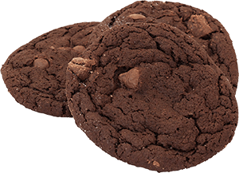

# 7.1 Cookies

在 `practice` 資料夾下，建立 `cookie.html` ，以便練習。\
並用網域(例：`http://127.0.0.1:5500/practice/cookie.html` )的方式來開啟。



## 什麼是 Cookie？

* Cookie 是網站在您瀏覽網頁時儲存在您的電腦上的資料。
* Cookie 可用於儲存各種資訊，包含個人識別資訊（例如姓名、id……等等）。
* 容量空間有限，大約 4K 左右。
* 可以設定 cookie 的存活期間，如果沒有設定，預設就是當下使用者瀏覽網頁的期間(session)，結束瀏覽器的話就自動消失。


## 在哪裡可看到 cookie 資訊？

開啟開發者工具，在 Application 頁籤當中。


## Cookie 的操作


### 建立 Cookie 與更新

以下程式建立了兩個 cookie，名稱(Name)叫做「**food\_id**」，值(Value)是「**abc**」；另一個是名稱叫做「**ad\_code**」，值是「**year2020**」：(執行完以下程式後，找出在哪裡看得到。)

```javascript
document.cookie = "food_id=abc";
document.cookie = "ad_code=year2020";
```


更新的語法同上，如果 food\_id 本身是已經存在的話，那就會是更新。



### 取得 Cookie

```javascript
var my_cookies = document.cookie;

console.log(my_cookies); // food_id=def; ad_code=year2020
```


會是一整個字串。如果想取得單一的資訊呢？\
其實滿麻煩。參考後續的函式提供。



### 設定 Cookie 存活期間

以下原始碼，設定 **ad\_code** 這個 cookie 的存活期間是到「`Thu, 18 Dec 2999 03:00:00 UTC`」

```javascript
document.cookie = "ad_code=year2020; expires=Thu, 18 Dec 2999 03:00:00 UTC";
```


### 刪除 Cookie

只要將 cookie 的存活期間設定成過去的時間，就會刪除，例：

```javascript
document.cookie = "ad_code=; expires=Thu, 18 Dec 2018 03:00:00 UTC";
```


## Cookie 有用函式

[https://www.w3schools.com/js/js\_cookies.asp](https://www.w3schools.com/js/js\_cookies.asp) 官方提供了 setCookie 及 getCookie 函式，讓我們方便設定 cookie 及 取得 cookie，第三個 checkCookie 是老師改寫，判斷某 cookie 是否存在，回傳 true 或 false。

```javascript
// 設定 cookie
function setCookie(cname, cvalue, exdays) {
  var d = new Date();
  d.setTime(d.getTime() + (exdays * 24 * 60 * 60 * 1000));
  var expires = "expires="+d.toUTCString();
  document.cookie = cname + "=" + cvalue + ";" + expires + ";path=/";
}

// 取得 cookie 的值
function getCookie(cname) {
  var name = cname + "=";
  var ca = document.cookie.split(';');
  for(var i = 0; i < ca.length; i++) {
    var c = ca[i];
    while (c.charAt(0) == ' ') {
      c = c.substring(1);
    }
    if (c.indexOf(name) == 0) {
      return c.substring(name.length, c.length);
    }
  }
  return "";
}

// 檢查某 cookie 是否存在
function checkCookie(cname) {
  var cookie_value = getCookie(cname);
  if (cookie_value != "") {
    return true;
  } else {
    return false;
  }
}
```

在 `practice/js/` 資料夾下，建立 `all_func.js` 檔案，將以上原始碼放進去。然後頁面要載入 `all_func.js` 檔案。

然後練習執行以下程式：

```javascript
setCookie("new_cookie", "new_value", 1); // 建立 cookie
console.log(getCookie("new_cookie"));    // 取得 new_cookie 的值
console.log(checkCookie("new_cookie"));  // 檢查 new_cookie 是否存在
```

