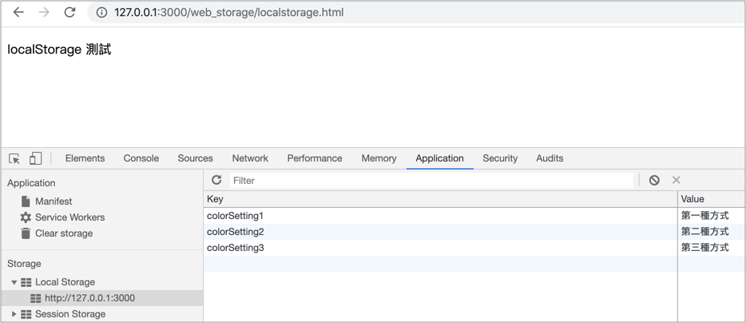

# 7.2 localStorage

在 `practice` 資料夾下，建立 `localstorage.html` ，以便練習。


在 html5 還沒有出來之前，本機端的儲存方式，使用的是 cookie，但空間有限，大約是 4k 左右。

而 html5 出來之後，多了 **localStorage** 儲存方式，空間更大，大約 5M，而且使用了 `key-value` 的儲存方式，使得更有彈性。

## cookie 與 localStorage 比較

| 特性   | cookie                  | localStorage    |
| ---- | ----------------------- | --------------- |
| 生命週期 | 預設是關閉瀏覽器後失效，但可以設定失效的時間。 | 除非手動清除，否則並不會消失。 |
| 大小   | 大約4K                    | 一般是 5Mb         |


## localStorage 儲存


以下是將資料儲存在 localStorage 的三種寫法，以 `key-value` 的方式儲存，例：

```javascript
localStorage.colorSetting1 = '第一種方式';
localStorage['colorSetting2'] = '第二種方式';
localStorage.setItem('colorSetting3', '第三種方式');
```

開啟本機端網址來觀察：[`http://127.0.0.1:3000/web_storage/localstorage.html`](http://127.0.0.1:3000/web\_storage/localstorage.html)``

如下圖：




儲存 JSON 格式資料，使用 **`JSON.stringify()`**將資料字串化：

```javascript
localStorage.setItem("car", JSON.stringify({doors: 4, brand_name: "toyota"}));
```


## localStorage 資料擷取

可透過以下方式取得 localStorage 裡的資料：

```javascript
var get_color = localStorage.colorSetting2;
// 或
var get_color = localStorage.getItem("colorSetting2");
// 或
var get_color = localStorage['colorSetting2'];
```

如果 localStorage 裡沒有指定的資料，會回傳 `undefined`。

如果有儲存 JSON 資料，取出時，通常會用 `JSON.parse()` 來轉回物件格式：

```javascript
var car = JSON.parse(localStorage.getItem("car"));
console.log(car);
```


## localStorage 資料更新

可透過以下方式來更新 localStorage 裡的資料：

```javascript
localStorage.colorSetting2 = "red";
// 或
localStorage.setItem("colorSetting2", "red");
// 或
localStorage['colorSetting2'] = "red";
```


## localStorage 資料刪除

可透過以下方式來刪除 localStorage 裡的資料：

```javascript
// 刪除單一項目
localStorage.removeItem("colorSetting2");

// 清空
localStorage.clear();
```


## 練習

儲存到 localStorage 裡的 key 名稱為 `books`，value 資料如下：

```javascript
[
  {
    "book_name": "HTML",
    "book_price": 299
  },
  {
    "book_name": "CSS",
    "book_price": 399
  },
  {
    "book_name": "JavaScript",
    "book_price": 499
  }
]
```

將以上的資料字串化(**`JSON.stringify()`**)存到  localStorage 以及取出後轉回物件(**`JSON.parse()`**)使用。


參考作法：




