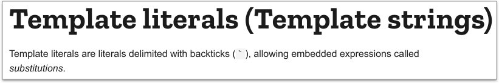

# 8.1 Template String



反引號(`backtick`)，數字 1 左邊那個鍵。

## template string

語法：

```javascript
// 寫法一：早期寫法，單純的字串串接方式
var li_string = "";
li_string += "<li>";
li_string +=   "<a href='#'>連結" + (li_count + 1) + "</a>";
li_string += "</li>";
```

現在可用以下寫法，比較簡潔：

```javascript
// 寫法二：template string
var li_string = `
  <li>
    <a href="#">連結${li_count + 1}</a>
  </li>
`;
```


也可以放變數，使用 **`${變數名稱}`** 語法。


例：



